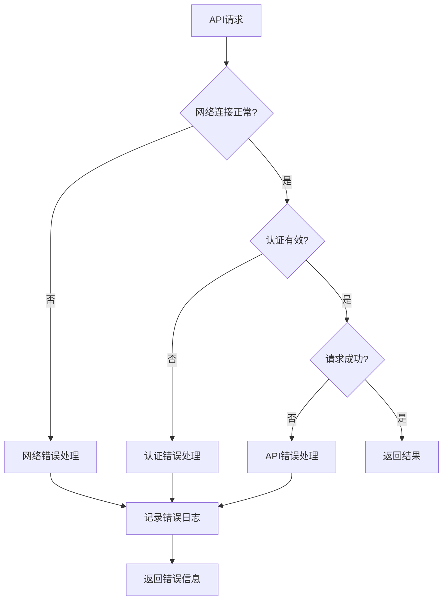

# 技术架构设计文档

## 1. 架构概述

### 1.1 整体架构
Dify Halo 插件采用模块化设计，基于 Dify Plugin Framework 构建，通过 REST API 与 Halo 系统进行交互。

```
┌─────────────────────────────────────────────────────────┐
│                   Dify Platform                         │
├─────────────────────────────────────────────────────────┤
│                Dify Plugin Framework                    │
├─────────────────────────────────────────────────────────┤
│                   Halo Plugin                           │
│  ┌─────────────┐ ┌─────────────┐ ┌─────────────┐       │
│  │   Auth      │ │   Article   │ │   Moment    │       │
│  │   Module    │ │   Module    │ │   Module    │       │
│  └─────────────┘ └─────────────┘ └─────────────┘       │
│         │              │              │                │
│  ┌─────────────────────────────────────────────────────┐│
│  │              HTTP Client Module                     ││
│  └─────────────────────────────────────────────────────┘│
├─────────────────────────────────────────────────────────┤
│                     Network Layer                       │
├─────────────────────────────────────────────────────────┤
│                    Halo REST API                        │
├─────────────────────────────────────────────────────────┤
│                   Halo Backend                          │
└─────────────────────────────────────────────────────────┘
```

### 1.2 设计原则
- **模块化**: 功能模块独立，便于维护和扩展
- **安全性**: 安全的认证和数据传输机制
- **可靠性**: 完善的错误处理和重试机制
- **性能**: 高效的 API 调用和资源管理
- **可扩展**: 易于添加新功能和适配新版本

### 1.3 技术栈
- **开发语言**: Python 3.8+
- **框架**: Dify Plugin Framework
- **HTTP 客户端**: requests/httpx
- **数据格式**: JSON
- **认证方式**: Bearer Token (Personal Access Token)

## 2. 模块设计

### 2.1 核心模块结构

```
halo_plugin/
├── __init__.py
├── main.py                 # 插件主入口
├── manifest.yaml           # 插件清单文件
├── config/
│   ├── __init__.py
│   └── settings.py         # 配置管理
├── auth/
│   ├── __init__.py
│   ├── authenticator.py    # 认证处理
│   └── token_manager.py    # 令牌管理
├── api/
│   ├── __init__.py
│   ├── client.py           # HTTP 客户端
│   ├── endpoints.py        # API 端点定义
│   └── models.py           # 数据模型
├── tools/
│   ├── __init__.py
│   ├── article_tools.py    # 文章相关工具
│   ├── moment_tools.py     # 瞬间相关工具
│   └── base_tool.py        # 工具基类
├── utils/
│   ├── __init__.py
│   ├── validators.py       # 数据验证
│   ├── formatters.py       # 数据格式化
│   └── exceptions.py       # 异常定义
└── tests/
    ├── __init__.py
    ├── test_auth.py
    ├── test_api.py
    └── test_tools.py
```

### 2.2 认证模块 (auth)

#### 2.2.1 认证器 (Authenticator)
```python
class HaloAuthenticator:
    """Halo 认证管理器"""
    
    def __init__(self, site_url: str, token: str):
        self.site_url = site_url
        self.token = token
        self.session = None
    
    def authenticate(self) -> bool:
        """验证认证信息"""
        
    def get_headers(self) -> dict:
        """获取请求头"""
        
    def refresh_token(self) -> bool:
        """刷新令牌"""
```

#### 2.2.2 令牌管理器 (TokenManager)
```python
class TokenManager:
    """令牌管理器"""
    
    def store_token(self, token: str) -> None:
        """安全存储令牌"""
        
    def get_token(self) -> str:
        """获取存储的令牌"""
        
    def validate_token(self, token: str) -> bool:
        """验证令牌格式"""
```

### 2.3 API 模块 (api)

#### 2.3.1 HTTP 客户端 (Client)
```python
class HaloAPIClient:
    """Halo API 客户端"""
    
    def __init__(self, authenticator: HaloAuthenticator):
        self.auth = authenticator
        self.base_url = authenticator.site_url
        self.session = requests.Session()
    
    def get(self, endpoint: str, params: dict = None) -> dict:
        """GET 请求"""
        
    def post(self, endpoint: str, data: dict = None) -> dict:
        """POST 请求"""
        
    def put(self, endpoint: str, data: dict = None) -> dict:
        """PUT 请求"""
        
    def delete(self, endpoint: str) -> dict:
        """DELETE 请求"""
```

#### 2.3.2 API 端点 (Endpoints)
```python
class HaloEndpoints:
    """Halo API 端点定义"""
    
    # 文章相关端点
    POSTS = "/api/v1alpha1/posts"
    POST_DETAIL = "/api/v1alpha1/posts/{name}"
    
    # 瞬间相关端点
    MOMENTS = "/api/v1alpha1/moments"
    MOMENT_DETAIL = "/api/v1alpha1/moments/{name}"
    
    # 分类和标签
    CATEGORIES = "/api/v1alpha1/categories"
    TAGS = "/api/v1alpha1/tags"
    
    # 用户信息
    USER_INFO = "/api/v1alpha1/users/-"
```

#### 2.3.3 数据模型 (Models)
```python
from dataclasses import dataclass
from typing import List, Optional
from datetime import datetime

@dataclass
class PostModel:
    """文章数据模型"""
    id: str
    title: str
    content: str
    excerpt: Optional[str] = None
    cover: Optional[str] = None
    categories: List[str] = None
    tags: List[str] = None
    status: str = "DRAFT"
    created_at: Optional[datetime] = None
    updated_at: Optional[datetime] = None

@dataclass
class MomentModel:
    """瞬间数据模型"""
    id: str
    content: Optional[str] = None
    media_urls: List[str] = None
    media_type: str = "PHOTO"
    tags: List[str] = None
    visibility: str = "PUBLIC"
    created_at: Optional[datetime] = None
```

### 2.4 工具模块 (tools)

#### 2.4.1 基础工具类 (BaseTool)
```python
from abc import ABC, abstractmethod

class BaseTool(ABC):
    """工具基类"""
    
    def __init__(self, api_client: HaloAPIClient):
        self.client = api_client
    
    @abstractmethod
    def execute(self, **kwargs):
        """执行工具操作"""
        pass
    
    def validate_input(self, **kwargs) -> bool:
        """验证输入参数"""
        pass
    
    def format_output(self, data: dict) -> dict:
        """格式化输出数据"""
        pass
```

#### 2.4.2 文章工具 (ArticleTools)
```python
class ArticleTools(BaseTool):
    """文章管理工具集"""
    
    def get_posts(self, page: int = 1, size: int = 10, **filters) -> dict:
        """获取文章列表"""
        
    def get_post_detail(self, post_id: str) -> dict:
        """获取文章详情"""
        
    def create_post(self, post_data: PostModel) -> dict:
        """创建文章"""
        
    def update_post(self, post_id: str, post_data: PostModel) -> dict:
        """更新文章"""
        
    def delete_post(self, post_id: str) -> dict:
        """删除文章"""
```

#### 2.4.3 瞬间工具 (MomentTools)
```python
class MomentTools(BaseTool):
    """瞬间管理工具集"""
    
    def create_moment(self, moment_data: MomentModel) -> dict:
        """创建瞬间"""
        
    def get_moments(self, page: int = 1, size: int = 10) -> dict:
        """获取瞬间列表"""
        
    def update_moment(self, moment_id: str, moment_data: MomentModel) -> dict:
        """更新瞬间"""
        
    def delete_moment(self, moment_id: str) -> dict:
        """删除瞬间"""
```

## 3. 数据流设计

### 3.1 认证流程


### 3.2 文章创建流程


### 3.3 错误处理流程


## 4. 安全设计

### 4.1 认证安全
- **令牌加密存储**: 使用 AES 加密存储个人访问令牌
- **HTTPS 强制**: 所有 API 请求强制使用 HTTPS
- **令牌验证**: 启动时验证令牌有效性
- **会话管理**: 安全的会话状态管理

### 4.2 数据安全
- **输入验证**: 严格的输入数据验证和清理
- **输出过滤**: 敏感信息过滤，避免泄露
- **错误处理**: 安全的错误信息返回
- **日志安全**: 日志中不记录敏感信息

### 4.3 通信安全
- **SSL/TLS**: 强制使用安全传输层
- **证书验证**: 验证服务器证书
- **超时控制**: 设置合理的请求超时时间
- **重试机制**: 安全的请求重试策略

## 5. 性能优化

### 5.1 缓存策略
- **认证缓存**: 缓存有效的认证信息
- **元数据缓存**: 缓存分类、标签等元数据
- **连接池**: 使用 HTTP 连接池
- **缓存过期**: 合理的缓存过期策略

### 5.2 并发控制
- **连接限制**: 限制并发连接数
- **请求队列**: 实现请求队列机制
- **超时处理**: 合理的超时时间设置
- **资源释放**: 及时释放资源

### 5.3 资源管理
- **内存管理**: 及时释放内存资源
- **文件处理**: 大文件分块处理
- **异步处理**: 适当使用异步操作
- **错误恢复**: 自动错误恢复机制

## 6. 可扩展性设计

### 6.1 插件架构
- **模块化设计**: 独立的功能模块
- **接口标准化**: 统一的接口规范
- **配置外部化**: 可配置的参数
- **版本兼容**: 向后兼容性支持

### 6.2 功能扩展
- **新工具添加**: 易于添加新的工具类
- **API 版本适配**: 支持多个 API 版本
- **自定义配置**: 支持用户自定义配置
- **插件集成**: 与其他插件的集成能力

## 7. 部署架构

### 7.1 部署环境
- **Python 环境**: Python 3.8+
- **依赖管理**: requirements.txt
- **配置文件**: YAML/JSON 配置
- **日志系统**: 结构化日志记录

### 7.2 监控和运维
- **健康检查**: 插件健康状态监控
- **性能监控**: API 响应时间监控
- **错误监控**: 错误率和异常监控
- **日志分析**: 结构化日志分析

---

**文档版本**: v1.0.0  
**创建日期**: 2024年12月  
**技术负责人**: 架构师  
**审核人**: 技术经理 