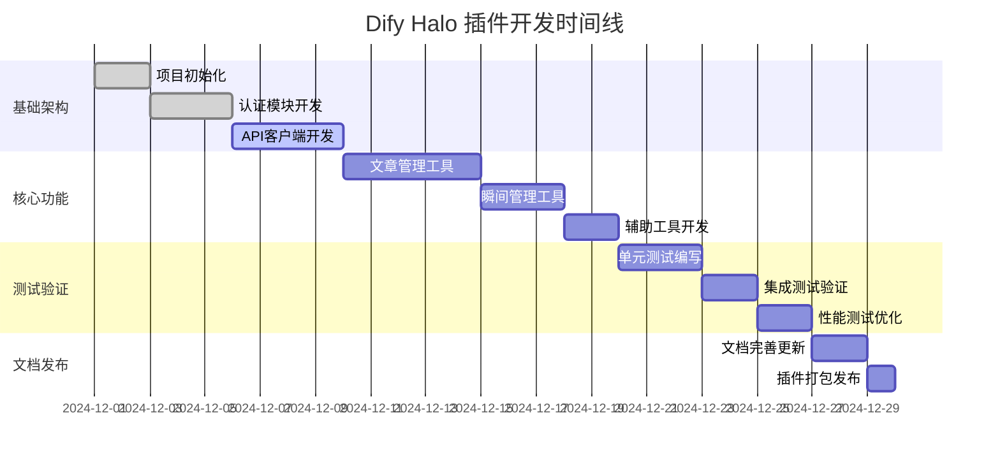

# 功能实现规划

## 1. 开发里程碑

### 1.1 项目时间线



### 1.2 开发阶段划分

#### 阶段一：基础架构 (第1-2周)
- 项目初始化和环境搭建
- 认证模块实现
- HTTP 客户端封装
- 基础异常和工具类

#### 阶段二：核心功能 (第3-4周)  
- 文章管理功能实现
- 瞬间管理功能实现
- 分类标签管理
- 数据验证和格式化

#### 阶段三：测试优化 (第5周)
- 单元测试和集成测试
- 性能优化和错误处理
- 安全性验证
- 代码质量提升

#### 阶段四：文档发布 (第6周)
- 文档完善和示例编写
- 插件打包和发布
- 用户反馈收集
- 后续维护计划

## 2. 详细功能实现

### 2.1 认证模块实现

#### 2.1.1 实现优先级：高
**目标**: 实现安全可靠的 Halo 认证机制

**技术要点**:
```python
class HaloAuthenticator:
    def __init__(self, site_url: str, token: str):
        # 初始化认证信息
        self.site_url = self._normalize_url(site_url)
        self.token = self._validate_token(token)
        self._session = None
        self._user_info = None
    
    def authenticate(self) -> bool:
        """验证认证信息有效性"""
        try:
            # 1. 验证令牌格式
            if not self._is_valid_token_format(self.token):
                return False
            
            # 2. 测试 API 连接
            response = self._test_connection()
            if response.status_code != 200:
                return False
                
            # 3. 验证权限
            permissions = self._get_user_permissions()
            if 'post:manage' not in permissions:
                raise PermissionError("令牌缺少文章管理权限")
                
            return True
        except Exception as e:
            logger.error(f"认证失败: {str(e)}")
            return False
```

**实现步骤**:
1. **Day 1**: 基础认证类框架
2. **Day 2**: 令牌验证和格式检查
3. **Day 3**: 权限验证和会话管理

#### 2.1.2 安全考虑
- 令牌加密存储
- 会话超时处理
- 错误信息脱敏
- 重试机制限制

### 2.2 API 客户端实现

#### 2.2.1 实现优先级：高
**目标**: 构建稳定高效的 HTTP 客户端

**技术要点**:
```python
class HaloAPIClient:
    def __init__(self, authenticator: HaloAuthenticator):
        self.auth = authenticator
        self.base_url = f"{authenticator.site_url}/api/v1alpha1"
        
        # 配置 HTTP 会话
        self.session = requests.Session()
        self.session.headers.update({
            'Authorization': f'Bearer {authenticator.token}',
            'Content-Type': 'application/json',
            'User-Agent': 'Dify-Halo-Plugin/1.0.0'
        })
        
        # 设置重试策略
        retry_strategy = Retry(
            total=3,
            backoff_factor=1,
            status_forcelist=[429, 500, 502, 503, 504]
        )
        adapter = HTTPAdapter(max_retries=retry_strategy)
        self.session.mount("http://", adapter)
        self.session.mount("https://", adapter)
```

**实现计划**:
- **Day 1-2**: 基础 HTTP 客户端和配置
- **Day 3**: 重试机制和错误处理
- **Day 4**: 响应缓存和性能优化

#### 2.2.2 性能优化
- 连接池管理
- 响应数据缓存
- 请求压缩支持
- 超时控制策略

### 2.3 文章管理工具实现

#### 2.3.1 实现优先级：高
**目标**: 完整的文章CRUD操作支持

**核心功能清单**:
1. ✅ 文章列表获取 (分页、筛选、搜索)
2. ✅ 文章详情获取 (完整内容和元数据)
3. ✅ 文章创建 (Markdown内容、分类标签)
4. ✅ 文章更新 (部分更新支持)
5. 🔄 文章删除 (软删除和永久删除)
6. 🔄 文章状态管理 (发布、草稿、回收站)

**实现示例**:
```python
class ArticleTools(BaseTool):
    def get_posts(self, **params) -> Dict[str, Any]:
        """获取文章列表
        
        支持参数:
        - page: 页码 (默认1)
        - size: 页面大小 (默认10，最大100)
        - keyword: 搜索关键词
        - category: 分类筛选
        - tag: 标签筛选
        - status: 状态筛选 (PUBLISHED/DRAFT/RECYCLE)
        - sort: 排序方式 (createTime/publishTime/updateTime)
        - order: 排序顺序 (desc/asc)
        """
        # 参数验证和默认值设置
        validated_params = self._validate_list_params(params)
        
        # 构建查询参数
        query_params = self._build_query_params(validated_params)
        
        # 发送 API 请求
        response = self.client.get('/posts', params=query_params)
        
        # 格式化返回数据
        return self._format_posts_response(response)
    
    def create_post(self, title: str, content: str, **kwargs) -> Dict[str, Any]:
        """创建新文章"""
        # 1. 数据验证
        post_data = self._validate_post_data({
            'title': title,
            'content': content,
            **kwargs
        })
        
        # 2. 处理分类和标签
        if post_data.get('categories'):
            post_data['categories'] = self._ensure_categories_exist(
                post_data['categories']
            )
        
        if post_data.get('tags'):
            post_data['tags'] = self._ensure_tags_exist(
                post_data['tags']
            )
        
        # 3. 构建请求体
        request_body = self._build_post_request(post_data)
        
        # 4. 创建文章
        response = self.client.post('/posts', data=request_body)
        
        # 5. 处理发布状态
        if post_data.get('publish_status') == 'PUBLISHED':
            self._publish_post(response['metadata']['name'])
        
        return self._format_post_response(response)
```

**实现时间安排**:
- **Day 1**: 文章列表和详情获取
- **Day 2**: 文章创建功能
- **Day 3**: 文章更新功能  
- **Day 4**: 分类标签处理
- **Day 5**: 状态管理和验证

### 2.4 瞬间管理工具实现

#### 2.4.1 实现优先级：中
**目标**: 支持多媒体瞬间内容创建

**核心功能**:
```python
class MomentTools(BaseTool):
    def create_moment(self, **kwargs) -> Dict[str, Any]:
        """创建瞬间
        
        支持参数:
        - content: 文本内容
        - media_urls: 媒体文件URL列表
        - media_type: 媒体类型 (PHOTO/VIDEO/AUDIO)
        - tags: 标签列表
        - visibility: 可见性 (PUBLIC/PRIVATE)
        """
        # 1. 验证输入数据
        moment_data = self._validate_moment_data(kwargs)
        
        # 2. 处理媒体文件
        if moment_data.get('media_urls'):
            processed_media = self._process_media_files(
                moment_data['media_urls'],
                moment_data.get('media_type', 'PHOTO')
            )
            moment_data['media'] = processed_media
        
        # 3. 处理标签
        if moment_data.get('tags'):
            moment_data['tags'] = self._ensure_moment_tags_exist(
                moment_data['tags']
            )
        
        # 4. 构建请求数据
        request_data = {
            'spec': {
                'content': {
                    'html': moment_data.get('content', ''),
                    'medium': moment_data.get('media', [])
                },
                'tags': moment_data.get('tags', []),
                'visible': moment_data.get('visibility', 'PUBLIC')
            }
        }
        
        # 5. 创建瞬间
        response = self.client.post('/moments', data=request_data)
        return self._format_moment_response(response)
```

**实现时间安排**:
- **Day 1**: 基础瞬间创建
- **Day 2**: 媒体文件处理
- **Day 3**: 标签和可见性管理

### 2.5 辅助工具实现

#### 2.5.1 分类标签管理
**目标**: 自动化的分类标签创建和管理

```python
class CategoryTagManager:
    def ensure_categories_exist(self, category_names: List[str]) -> List[Dict]:
        """确保分类存在，不存在则创建"""
        existing_categories = self._get_all_categories()
        existing_names = {cat['name'] for cat in existing_categories}
        
        result_categories = []
        for name in category_names:
            if name in existing_names:
                # 找到现有分类
                category = next(cat for cat in existing_categories if cat['name'] == name)
                result_categories.append(category)
            else:
                # 创建新分类
                new_category = self._create_category(name)
                result_categories.append(new_category)
        
        return result_categories
```

#### 2.5.2 数据验证器
**目标**: 完善的输入数据验证

```python
class DataValidator:
    def validate_post_data(self, data: Dict) -> Dict:
        """验证文章数据"""
        errors = []
        
        # 必需字段验证
        if not data.get('title'):
            errors.append("标题不能为空")
        elif len(data['title']) > 255:
            errors.append("标题长度不能超过255字符")
        
        if not data.get('content'):
            errors.append("内容不能为空")
        elif len(data['content']) > 1024 * 1024:  # 1MB
            errors.append("内容大小不能超过1MB")
        
        # 可选字段验证
        if data.get('categories') and len(data['categories']) > 20:
            errors.append("分类数量不能超过20个")
        
        if data.get('tags') and len(data['tags']) > 20:
            errors.append("标签数量不能超过20个")
        
        if errors:
            raise ValidationError('; '.join(errors))
        
        return data
```

## 3. 技术难点解决方案

### 3.1 认证令牌安全存储
**问题**: 如何安全存储和管理用户的访问令牌

**解决方案**:
```python
from cryptography.fernet import Fernet
import keyring

class SecureTokenManager:
    def __init__(self):
        self.key = self._get_or_create_key()
        self.cipher = Fernet(self.key)
    
    def store_token(self, site_url: str, token: str):
        """安全存储令牌"""
        encrypted_token = self.cipher.encrypt(token.encode())
        keyring.set_password("dify-halo-plugin", site_url, encrypted_token.decode())
    
    def get_token(self, site_url: str) -> str:
        """获取存储的令牌"""
        encrypted_token = keyring.get_password("dify-halo-plugin", site_url)
        if encrypted_token:
            return self.cipher.decrypt(encrypted_token.encode()).decode()
        return None
```

### 3.2 API 版本兼容性
**问题**: 不同版本 Halo 的 API 差异处理

**解决方案**:
```python
class APIVersionManager:
    def __init__(self, client: HaloAPIClient):
        self.client = client
        self.version = self._detect_version()
        self.endpoint_mapper = self._get_endpoint_mapper()
    
    def get_endpoint(self, action: str) -> str:
        """根据版本获取正确的端点"""
        return self.endpoint_mapper.get(self.version, {}).get(action)
    
    def _detect_version(self) -> str:
        """检测 Halo 版本"""
        try:
            response = self.client.get('/actuator/info')
            return response.get('version', '2.21.0')
        except:
            return '2.21.0'  # 默认版本
```

### 3.3 并发请求控制
**问题**: 防止过多并发请求影响 Halo 性能

**解决方案**:
```python
import asyncio
from asyncio import Semaphore

class RateLimitedClient:
    def __init__(self, max_concurrent: int = 5):
        self.semaphore = Semaphore(max_concurrent)
        self.request_times = []
    
    async def limited_request(self, method, *args, **kwargs):
        """限制并发的请求"""
        async with self.semaphore:
            # 实现请求频率限制
            await self._check_rate_limit()
            
            # 执行实际请求
            return await self._execute_request(method, *args, **kwargs)
```

## 4. 质量保证措施

### 4.1 代码质量检查
- **Pylint**: 代码质量评分 ≥ 8.0/10
- **Black**: 代码格式化一致性
- **MyPy**: 类型注解验证
- **Coverage**: 测试覆盖率 ≥ 80%

### 4.2 性能基准
- **API 响应时间**: ≤ 2秒 (95% 请求)
- **内存使用**: ≤ 100MB (正常操作)
- **并发处理**: 支持 10 个并发请求
- **错误率**: ≤ 1% (正常网络环境)

### 4.3 安全检查清单
- [ ] 输入数据验证和清理
- [ ] SQL注入防护 (如适用)
- [ ] XSS攻击防护
- [ ] 敏感信息加密存储
- [ ] 错误信息脱敏
- [ ] API 频率限制

## 5. 风险评估和应对

### 5.1 技术风险
| 风险项目 | 影响等级 | 概率 | 应对措施 |
|---------|---------|------|----------|
| Halo API 变更 | 高 | 中 | 版本检测和适配机制 |
| 网络连接不稳定 | 中 | 高 | 重试机制和超时处理 |
| 性能瓶颈 | 中 | 中 | 缓存和连接池优化 |
| 认证失效 | 高 | 低 | 自动重新认证机制 |

### 5.2 业务风险
| 风险项目 | 影响等级 | 概率 | 应对措施 |
|---------|---------|------|----------|
| 用户数据丢失 | 高 | 低 | 数据备份和恢复机制 |
| 功能不满足需求 | 中 | 中 | 敏捷开发和快速迭代 |
| 竞品功能领先 | 低 | 中 | 差异化功能设计 |

## 6. 后续维护计划

### 6.1 短期计划 (1-3个月)
- 用户反馈收集和问题修复
- 性能优化和稳定性提升
- 功能补充和完善
- 文档更新和示例丰富

### 6.2 中期计划 (3-6个月)
- 新功能开发 (评论管理、附件上传等)
- 多站点支持
- 高级筛选和搜索功能
- 批量操作优化

### 6.3 长期计划 (6-12个月)
- 插件生态集成
- 高级分析功能
- 工作流自动化
- 企业级功能支持

---

**文档版本**: v1.0.0  
**创建日期**: 2024年12月  
**项目经理**: 开发团队  
**审核人**: 技术负责人 