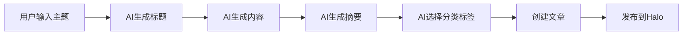

# 用户使用手册

## 1. 快速开始

### 1.1 环境要求
- **Dify 平台**: 已部署的 Dify 实例
- **Halo 博客**: 2.21.0 或更高版本
- **网络连接**: 确保 Dify 可以访问您的 Halo 博客
- **访问权限**: 具有"文章管理"权限的 Halo 个人访问令牌

### 1.2 5分钟快速体验
1. **安装插件** - 在 Dify 插件市场搜索"Halo"并安装
2. **配置连接** - 填入您的 Halo 站点地址和访问令牌
3. **创建工作流** - 添加 Halo 工具到您的工作流中
4. **发布文章** - 使用 AI 生成内容并一键发布到博客

## 2. 安装和配置

### 2.1 插件安装

#### 方式一：Dify 插件市场安装 (推荐)
1. 登录 Dify 管理后台
2. 进入"插件市场"页面
3. 搜索"Halo 博客集成"
4. 点击"安装"按钮
5. 等待安装完成

#### 方式二：手动安装
1. 下载插件包 `dify-halo-plugin.zip`
2. 在 Dify 后台选择"上传插件"
3. 选择下载的插件包
4. 确认安装设置
5. 完成安装

### 2.2 获取 Halo 访问令牌

#### 步骤详解:
1. **登录 Halo 后台**
   - 访问您的 Halo 管理后台
   - 使用管理员账号登录

2. **进入用户中心**
   - 点击右上角头像
   - 选择"个人资料"

3. **创建个人令牌**
   - 找到"个人令牌"选项卡
   - 点击"新建令牌"
   
   

4. **配置令牌权限**
   ```
   令牌名称: Dify 集成插件
   过期时间: 永不过期 (或根据需要设置)
   权限范围: 
   ☑️ 文章管理 (post:manage)
   ☑️ 瞬间管理 (moment:manage)  
   ☑️ 分类管理 (category:manage)
   ☑️ 标签管理 (tag:manage)
   ```

5. **复制令牌**
   - 创建成功后立即复制令牌
   - ⚠️ **重要**: 令牌只显示一次，请妥善保存

### 2.3 配置插件连接

1. **添加 Halo 工具**
   - 在 Dify 工作流中添加"工具"节点
   - 选择"Halo 博客集成"工具

2. **配置连接信息**
   ```
   站点地址: https://your-blog.example.com
   访问令牌: pat_xxxxxxxxxxxxxxxxxxxxxxxx
   ```

3. **测试连接**
   - 点击"测试连接"按钮
   - 确认显示"连接成功"及您的博客信息

## 3. 功能使用指南

### 3.1 文章管理

#### 3.1.1 获取文章列表
**工具**: `get_posts`

**基础用法**:
```yaml
# 工作流配置示例
- 工具: get_posts
  参数:
    page: 1
    size: 10
```

**高级筛选**:
```yaml
# 筛选已发布的技术文章
- 工具: get_posts
  参数:
    status: PUBLISHED
    category: 技术
    keyword: Python
    size: 20
```

**参数说明**:
| 参数 | 类型 | 必需 | 说明 | 示例 |
|------|------|------|------|------|
| page | 数字 | 否 | 页码，默认1 | 1 |
| size | 数字 | 否 | 每页数量，默认10，最大100 | 20 |
| keyword | 文本 | 否 | 搜索关键词 | "人工智能" |
| category | 文本 | 否 | 分类筛选 | "技术" |
| tag | 文本 | 否 | 标签筛选 | "Python" |
| status | 选项 | 否 | 状态筛选 | PUBLISHED/DRAFT |

#### 3.1.2 获取文章详情
**工具**: `get_post_detail`

**使用示例**:
```yaml
- 工具: get_post_detail
  参数:
    post_id: "post-123"
```

**返回信息**:
- 完整的 Markdown 内容
- 文章元数据 (标题、摘要、分类、标签)
- 发布信息 (状态、时间、作者)
- 统计数据 (浏览量、评论数)

#### 3.1.3 创建新文章
**工具**: `create_post`

**基础创建**:
```yaml
- 工具: create_post
  参数:
    title: "我的第一篇 AI 生成文章"
    content: |
      # 文章标题
      
      这是由 AI 生成的精彩内容...
      
      ## 小节标题
      
      更多内容...
```

**完整配置**:
```yaml
- 工具: create_post
  参数:
    title: "深入理解人工智能"
    content: |
      # 深入理解人工智能
      
      人工智能是当今最热门的技术话题之一...
    excerpt: "本文将深入探讨人工智能的基本概念和应用"
    cover: "https://example.com/ai-cover.jpg"
    categories: ["技术", "人工智能"]
    tags: ["AI", "机器学习", "深度学习"]
    publish_status: "PUBLISHED"
    allow_comment: true
    pinned: false
```

**参数详解**:
| 参数 | 类型 | 必需 | 说明 |
|------|------|------|------|
| title | 文本 | ✅ | 文章标题，最大255字符 |
| content | 文本 | ✅ | Markdown格式的文章内容 |
| excerpt | 文本 | ❌ | 文章摘要，用于SEO和列表显示 |
| cover | URL | ❌ | 封面图片链接 |
| categories | 列表 | ❌ | 分类名称列表 |
| tags | 列表 | ❌ | 标签名称列表 |
| publish_status | 选项 | ❌ | PUBLISHED(发布) / DRAFT(草稿) |
| allow_comment | 布尔 | ❌ | 是否允许评论，默认true |
| pinned | 布尔 | ❌ | 是否置顶，默认false |

#### 3.1.4 更新现有文章
**工具**: `update_post`

**使用示例**:
```yaml
- 工具: update_post
  参数:
    post_id: "post-123"
    title: "更新后的标题"
    content: |
      # 更新后的内容
      
      这是修改后的文章内容...
    tags: ["更新", "修订"]
    publish_status: "PUBLISHED"
```

### 3.2 瞬间管理

#### 3.2.1 创建图文瞬间
**工具**: `create_moment`

**纯文字瞬间**:
```yaml
- 工具: create_moment
  参数:
    content: "今天是个好天气，心情不错！😊"
    tags: ["生活", "心情"]
    visibility: "PUBLIC"
```

**图文瞬间**:
```yaml
- 工具: create_moment
  参数:
    content: "分享今天拍摄的美丽风景"
    media_urls: 
      - "https://example.com/photo1.jpg"
      - "https://example.com/photo2.jpg"
    media_type: "PHOTO"
    tags: ["摄影", "风景"]
    visibility: "PUBLIC"
```

**参数说明**:
| 参数 | 类型 | 必需 | 说明 |
|------|------|------|------|
| content | 文本 | ❌ | 瞬间文字内容 |
| media_urls | 列表 | ❌ | 媒体文件URL列表 |
| media_type | 选项 | ❌ | PHOTO/VIDEO/AUDIO |
| tags | 列表 | ❌ | 标签列表 |
| visibility | 选项 | ❌ | PUBLIC/PRIVATE |

#### 3.2.2 获取瞬间列表
**工具**: `get_moments`

```yaml
- 工具: get_moments
  参数:
    page: 1
    size: 10
    tag: "生活"
```

### 3.3 辅助功能

#### 3.3.1 获取分类列表
**工具**: `get_categories`

```yaml
- 工具: get_categories
# 无需参数，返回所有分类
```

#### 3.3.2 获取标签列表
**工具**: `get_tags`

```yaml
- 工具: get_tags
# 无需参数，返回所有标签
```

## 4. 实际应用场景

### 4.1 AI 内容创作工作流

**场景**: 使用 AI 生成博客文章并自动发布



**工作流配置**:
```yaml
1. 大语言模型:
   输入: 用户提供的文章主题
   提示词: "基于主题生成一篇专业的博客文章"
   
2. 文本处理:
   提取标题、内容、摘要
   
3. Halo工具 - create_post:
   title: {{标题}}
   content: {{内容}}
   excerpt: {{摘要}}
   categories: ["AI生成"]
   tags: ["自动化", "AI"]
   publish_status: "DRAFT"
```

### 4.2 批量内容管理

**场景**: 批量更新文章分类或标签

```yaml
1. Halo工具 - get_posts:
   status: "PUBLISHED"
   category: "旧分类"
   
2. 代码执行:
   遍历文章列表
   
3. Halo工具 - update_post:
   post_id: {{文章ID}}
   categories: ["新分类"]
```

### 4.3 定时内容发布

**场景**: 预定时间自动发布草稿文章

```yaml
1. 定时器:
   每天上午9点执行
   
2. Halo工具 - get_posts:
   status: "DRAFT"
   
3. 条件判断:
   检查发布时间条件
   
4. Halo工具 - update_post:
   post_id: {{文章ID}}
   publish_status: "PUBLISHED"
```

### 4.4 社交媒体同步

**场景**: 文章发布后自动创建瞬间分享

```yaml
1. Halo工具 - create_post:
   创建新文章
   
2. 文本处理:
   生成分享文案
   
3. Halo工具 - create_moment:
   content: "新文章发布: {{文章标题}} {{文章链接}}"
   tags: ["新文章", "分享"]
```

## 5. 错误处理和故障排除

### 5.1 常见错误及解决方案

#### 连接失败
**错误信息**: "网络连接失败"
**可能原因**:
- 网络连接问题
- Halo 站点地址错误
- 防火墙阻拦

**解决方案**:
1. 检查网络连接
2. 确认 Halo 站点地址格式正确
3. 检查防火墙设置

#### 认证失败
**错误信息**: "访问令牌无效"
**可能原因**:
- 令牌已过期
- 令牌权限不足
- 令牌格式错误

**解决方案**:
1. 重新生成访问令牌
2. 确认令牌包含所需权限
3. 检查令牌是否完整复制

#### 参数错误
**错误信息**: "参数验证失败"
**可能原因**:
- 必需参数缺失
- 参数格式不正确
- 参数值超出范围

**解决方案**:
1. 检查必需参数是否提供
2. 确认参数格式符合要求
3. 查看参数值范围限制

### 5.2 调试技巧

#### 开启详细日志
```yaml
# 在工具配置中开启调试模式
- 工具: create_post
  调试模式: true
  参数:
    title: "测试文章"
    content: "测试内容"
```

#### 测试连接
```yaml
# 使用简单的获取分类来测试连接
- 工具: get_categories
```

#### 分步验证
1. 先测试连接是否正常
2. 再测试简单的读取操作
3. 最后测试复杂的写入操作

## 6. 最佳实践

### 6.1 内容创作最佳实践

#### Markdown 格式规范
```markdown
# 一级标题 (文章标题)

## 二级标题 (章节)

### 三级标题 (小节)

**粗体文字**
*斜体文字*

- 无序列表项1
- 无序列表项2

1. 有序列表项1
2. 有序列表项2

[链接文字](https://example.com)


```代码块```
```

#### 分类和标签策略
- **分类**: 使用主要主题分类，如"技术"、"生活"、"教程"
- **标签**: 使用具体的关键词，如"Python"、"AI"、"机器学习"
- **数量控制**: 分类不超过3个，标签不超过10个

### 6.2 工作流设计最佳实践

#### 错误处理
```yaml
# 添加错误处理节点
- 条件判断:
    条件: {{工具执行结果.success}} == true
    成功分支: 继续下一步
    失败分支: 错误处理
```

#### 数据验证
```yaml
# 验证必要数据
- 条件判断:
    条件: {{title}} != null and {{content}} != null
    通过: 执行创建
    失败: 提示错误
```

#### 性能优化
- 使用分页获取大量数据
- 避免过于频繁的API调用
- 合理设置缓存策略

### 6.3 安全最佳实践

#### 令牌管理
- 定期更换访问令牌
- 设置合理的过期时间
- 仅授予必要的权限

#### 内容安全
- 验证用户输入内容
- 过滤恶意代码和脚本
- 设置内容长度限制

## 7. 高级功能

### 7.1 自定义工作流模板

#### 博客助手模板
```yaml
名称: AI博客助手
描述: 从创意到发布的完整博客创作流程

工作流:
  1. 输入节点: 文章主题
  2. LLM节点: 生成大纲
  3. LLM节点: 生成正文
  4. LLM节点: 生成摘要
  5. Halo工具: 创建文章
  6. 条件节点: 是否立即发布
  7. Halo工具: 更新发布状态
```

#### 内容管理模板
```yaml
名称: 批量内容管理
描述: 批量管理博客内容

工作流:
  1. Halo工具: 获取文章列表
  2. 循环节点: 遍历文章
  3. 条件节点: 判断更新条件
  4. Halo工具: 更新文章
  5. 汇总节点: 统计结果
```

### 7.2 API 高级用法

#### 复杂查询
```yaml
# 查询最近一周的热门文章
- 工具: get_posts
  参数:
    size: 50
    status: "PUBLISHED"
    # 需要在后续节点中过滤时间和排序
```

#### 批量操作
```yaml
# 批量更新文章标签
工作流:
  1. 获取目标文章列表
  2. 循环处理每篇文章
  3. 更新标签
  4. 记录处理结果
```

## 8. 社区和支持

### 8.1 获取帮助
- **官方文档**: [文档链接]
- **GitHub 仓库**: [仓库链接]
- **问题报告**: [Issues 链接]
- **讨论社区**: [讨论区链接]

### 8.2 贡献指南
- 报告问题和建议
- 提交功能请求
- 参与代码贡献
- 完善文档内容

### 8.3 更新日志
插件会定期更新以支持新功能和修复问题，请关注：
- Dify 插件市场的更新通知
- GitHub 的 Release 页面
- 官方公告和博客

---

**文档版本**: v1.0.0  
**创建日期**: 2024年12月  
**技术支持**: support@example.com  
**用户手册维护**: 产品团队 