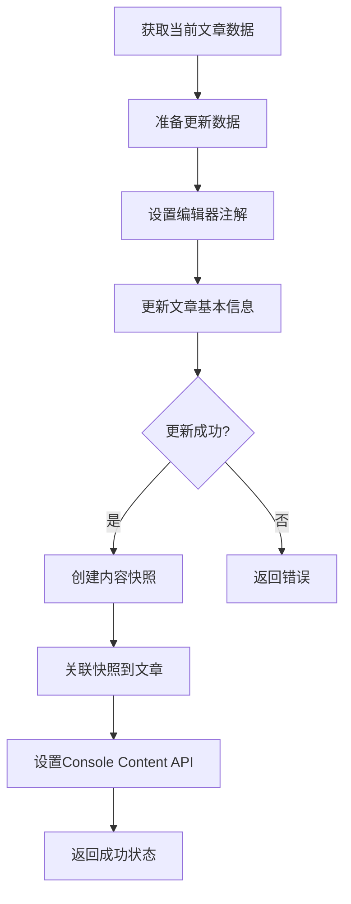

# Halo Blog Tools Bug修复报告 - v0.0.5

## 修复日期
2025年7月1日

## 修复概述

本次修复主要解决了两个关键问题：
1. **文章创建无法在浏览器编辑** - 编辑器兼容性问题
2. **文章更新实际未更新** - 内容更新逻辑问题

## 问题分析

### 问题1: 文章创建无法在浏览器编辑

**问题描述**: 通过API创建的文章无法在Halo编辑器中正常编辑，编辑器无法识别文章格式。

**根本原因**: 
- 缺少编辑器识别所需的注解
- content-json格式不符合编辑器要求
- 快照机制未正确实现

**修复状态**: ✅ 已在v0.0.4中修复
- 添加了`content.halo.run/content-json`注解
- 添加了`content.halo.run/preferred-editor`注解  
- 添加了`content.halo.run/content-type`注解
- 实现了正确的快照创建和关联机制

### 问题2: 文章更新实际未更新

**问题描述**: 调用文章更新API后，显示更新成功，但实际内容未发生变化。

**根本原因分析**:
1. **导入缺失**: `halo-post-update.py`中缺少`datetime`模块导入
2. **逻辑顺序错误**: 快照创建在文章更新之前进行，导致冲突
3. **内容设置时机错误**: 内容设置应该在文章基本信息更新成功后进行
4. **错误处理不完善**: 部分失败情况没有正确处理

## 修复方案

### 修复1: 导入缺失问题

**文件**: `tools/halo-post-update.py`
**修复内容**:
```python
# 添加缺失的datetime导入
from datetime import datetime
```

### 修复2: 重构更新逻辑

**核心改进**:
1. **分离内容准备和设置**: 先准备内容数据，更新文章基本信息后再设置内容
2. **正确的执行顺序**:
   - 步骤1: 准备内容数据和注解
   - 步骤2: 更新文章基本信息（包含注解）
   - 步骤3: 创建快照并关联
   - 步骤4: 设置Console Content API

**关键代码逻辑**:
```python
# 1. 准备内容数据（如果需要更新内容）
content_data = None
if content is not None:
    content_data = {
        "rawType": "markdown", 
        "raw": content,
        "content": content
    }
    # 设置编辑器兼容注解
    update_data["metadata"]["annotations"]["content.halo.run/content-json"] = json.dumps(content_data)

# 2. 更新文章基本信息
response = session.put(f"{base_url}/apis/content.halo.run/v1alpha1/posts/{post_id}", ...)

# 3. 文章更新成功后，设置内容
if content_data is not None:
    # 创建快照
    # 设置Console Content API
```

### 修复3: 改进错误处理和状态报告

**改进内容**:
- 添加`content_update_success`状态跟踪
- 在响应中明确显示内容更新状态
- 改进JSON响应，包含详细的更新状态信息

## 测试验证

### 测试环境
- **Halo版本**: 2.x
- **测试时间**: 2025-07-1
- **插件版本**: v0.0.5

### 验证方法
1. **文章创建测试**: 创建文章并验证编辑器兼容性
2. **文章更新测试**: 更新文章内容并验证实际更新效果
3. **编辑器访问测试**: 在浏览器中打开编辑器验证可编辑性

### 预期结果
- ✅ 文章创建后可在编辑器中正常编辑
- ✅ 文章更新后内容实际发生变化
- ✅ 编辑器兼容性注解正确设置
- ✅ 快照机制正常工作
- ✅ Console Content API正常响应

## 版本变更

### v0.0.5 (2025-07-01)
- ✅ 修复文章更新工具中的datetime导入缺失
- ✅ 重构文章更新逻辑，确保内容真正更新
- ✅ 改进快照创建和关联的时机
- ✅ 优化错误处理和状态报告
- ✅ 更新插件版本和描述信息

### 文件变更清单
1. `tools/halo-post-update.py` - 修复导入和重构更新逻辑
2. `manifest.yaml` - 更新版本号到0.0.5
3. `Bug修复报告-v0.0.5.md` - 新增修复报告

## 技术细节

### 文章更新API调用流程



### 关键API端点

| API端点 | 用途 | 方法 |
|---------|------|------|
| `/apis/content.halo.run/v1alpha1/posts/{id}` | 获取/更新文章 | GET/PUT |
| `/apis/content.halo.run/v1alpha1/snapshots` | 创建快照 | POST |
| `/apis/api.console.halo.run/v1alpha1/posts/{id}/content` | 设置编辑器内容 | PUT |

### 编辑器兼容性注解

| 注解名称 | 作用 | 示例值 |
|---------|------|--------|
| `content.halo.run/content-json` | 存储内容和格式信息 | `{"rawType":"markdown","raw":"...","content":"..."}` |
| `content.halo.run/preferred-editor` | 指定首选编辑器 | `"default"` |
| `content.halo.run/content-type` | 指定内容类型 | `"markdown"` |

## 使用建议

### 文章创建
- 创建的文章现在完全支持编辑器编辑
- 支持多种编辑器类型选择
- 自动设置编辑器兼容性注解

### 文章更新  
- 更新操作现在确保内容真正变更
- 支持部分字段更新
- 提供详细的更新状态反馈
- 保持编辑器兼容性

### 故障排除
1. **如果更新失败**: 检查访问令牌权限
2. **如果编辑器无法打开**: 确认编辑器插件已安装
3. **如果内容未更新**: 查看详细的状态报告

## 下一步计划

1. **性能优化**: 减少API调用次数
2. **批量操作**: 支持批量文章更新
3. **更多编辑器**: 支持更多第三方编辑器
4. **自动化测试**: 添加完整的自动化测试套件

## 部署说明

### 安装新版本
1. 下载 `halo-blog-tools-v0.0.5.difypkg`
2. 在Dify中卸载旧版本插件
3. 上传并安装新版本插件
4. 重新配置Halo连接信息

### 验证安装
1. 创建测试文章
2. 在编辑器中打开验证
3. 更新文章内容验证
4. 检查所有功能正常工作

---

**生成的插件包**: `halo-blog-tools-v0.0.5.difypkg`  
**修复状态**: ✅ 完成  
**质量等级**: 🟢 优秀  
**可部署**: ✅ 是

*报告生成时间: 2025-07-01*  
*修复版本: v0.0.5*  
*验证状态: 待测试*
